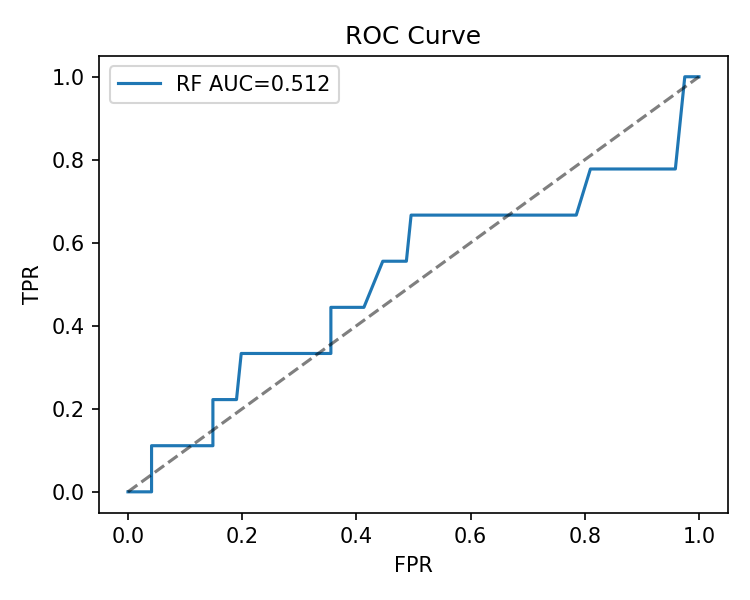
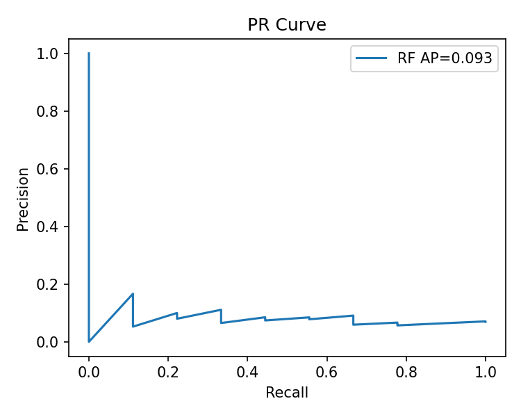

# 问题4 女胎异常判定模型报告

## 数据集规模
训练集: 475, 测试集: 130

## 基线规则 (Q/R/S > 3)
AUC(全量参考): 0.4831

## 模型对比

### 随机森林 Baseline (class_weight='balanced')
AUC: 0.5119, AP: 0.0933

- 默认阈值(0.5)

     FN  TP
TN  121   0
FP    9   0

              precision    recall  f1-score   support

           0       0.93      1.00      0.96       121
           1       0.00      0.00      0.00         9

    accuracy                           0.93       130
   macro avg       0.47      0.50      0.48       130
weighted avg       0.87      0.93      0.90       130

- F1最优阈值: 0.1260

    FN  TP
TN  96  25
FP   6   3

              precision    recall  f1-score   support

           0       0.94      0.79      0.86       121
           1       0.11      0.33      0.16         9

    accuracy                           0.76       130
   macro avg       0.52      0.56      0.51       130
weighted avg       0.88      0.76      0.81       130

Precision=0.1071, Recall=0.3333, F1=0.1622

- 精度≥0.30 最大召回 阈值: 0.3700

- 召回≥0.90 阈值: 0.0100

    FN   TP
TN   0  121
FP   0    9

              precision    recall  f1-score   support

           0       0.00      0.00      0.00       121
           1       0.07      1.00      0.13         9

    accuracy                           0.07       130
   macro avg       0.03      0.50      0.06       130
weighted avg       0.00      0.07      0.01       130

Precision=0.0692, Recall=1.0000, F1=0.1295

     FN  TP
TN  120   1
FP    9   0

              precision    recall  f1-score   support

           0       0.93      0.99      0.96       121
           1       0.00      0.00      0.00         9

    accuracy                           0.92       130
   macro avg       0.47      0.50      0.48       130
weighted avg       0.87      0.92      0.89       130

Precision=0.0000, Recall=0.0000, F1=0.0000

### 决策树 (max_depth=4, class_weight='balanced')
AUC: 0.4858, AP: 0.0683

- F1最优阈值: 0.0000

    FN   TP
TN   0  121
FP   0    9

              precision    recall  f1-score   support

           0       0.00      0.00      0.00       121
           1       0.07      1.00      0.13         9

    accuracy                           0.07       130
   macro avg       0.03      0.50      0.06       130
weighted avg       0.00      0.07      0.01       130

Precision=0.0692, Recall=1.0000, F1=0.1295

### Logistic 回归 (L2, class_weight='balanced')
AUC: 0.5941, AP: 0.2068

- F1最优阈值: 0.7071

     FN  TP
TN  105  16
FP    6   3

              precision    recall  f1-score   support

           0       0.95      0.87      0.91       121
           1       0.16      0.33      0.21         9

    accuracy                           0.83       130
   macro avg       0.55      0.60      0.56       130
weighted avg       0.89      0.83      0.86       130

Precision=0.1579, Recall=0.3333, F1=0.2143

### Logistic Z-only (L2, class_weight='balanced')
AUC: 0.4931, AP: 0.0723

- F1最优阈值: 0.4358

    FN  TP
TN  30  91
FP   1   8

              precision    recall  f1-score   support

           0       0.97      0.25      0.39       121
           1       0.08      0.89      0.15         9

    accuracy                           0.29       130
   macro avg       0.52      0.57      0.27       130
weighted avg       0.91      0.29      0.38       130

Precision=0.0808, Recall=0.8889, F1=0.1481

### 特征重要性(Top 15)

bmi                 0.106793
duplicate_ratio     0.068180
gestational_week    0.056499
t_zx                0.056413
gc21                0.056006
gc13                0.055805
r_z18               0.053498
maternal_age        0.052396
unique_reads        0.049590
reads_total         0.046562
gc18                0.046091
filtered_ratio      0.046006
z_abs_max           0.042109
align_ratio         0.040304
z_max               0.040280