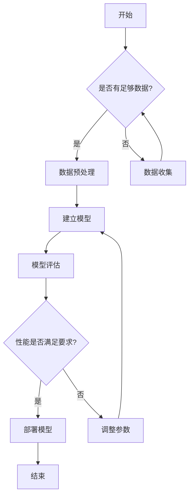
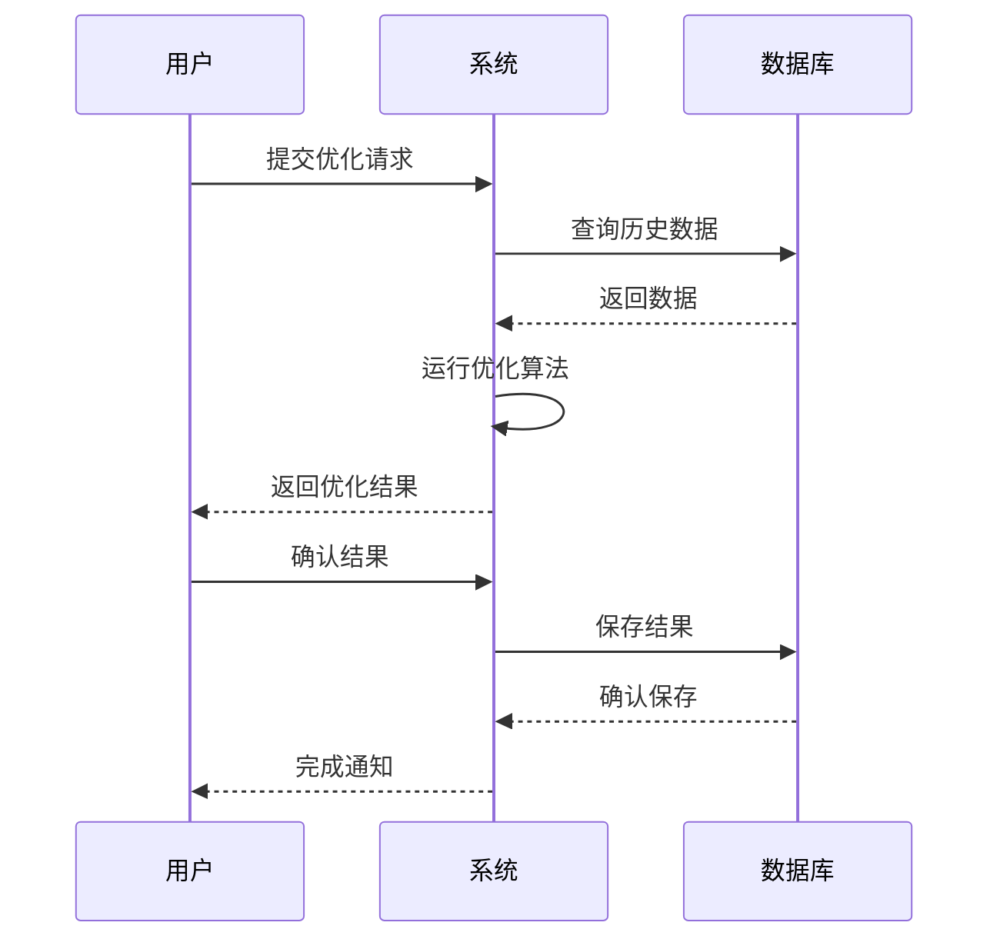
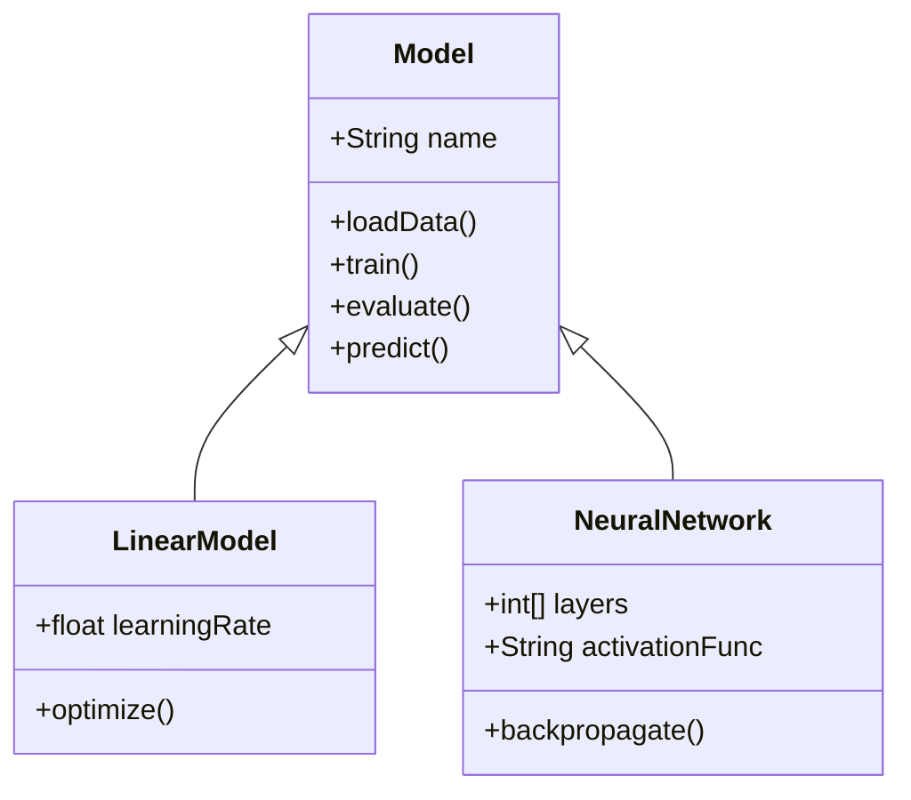
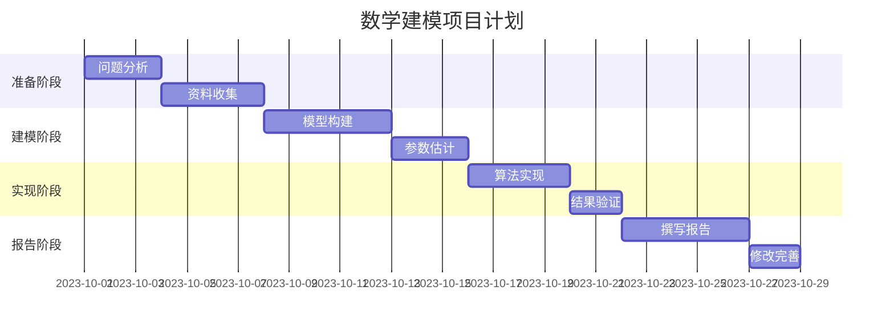
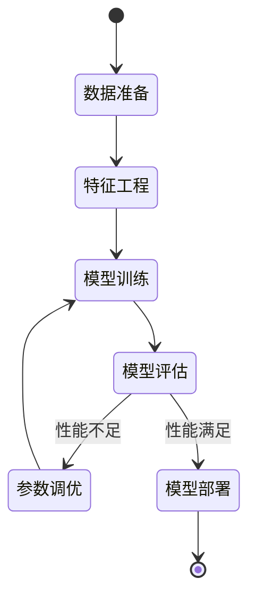
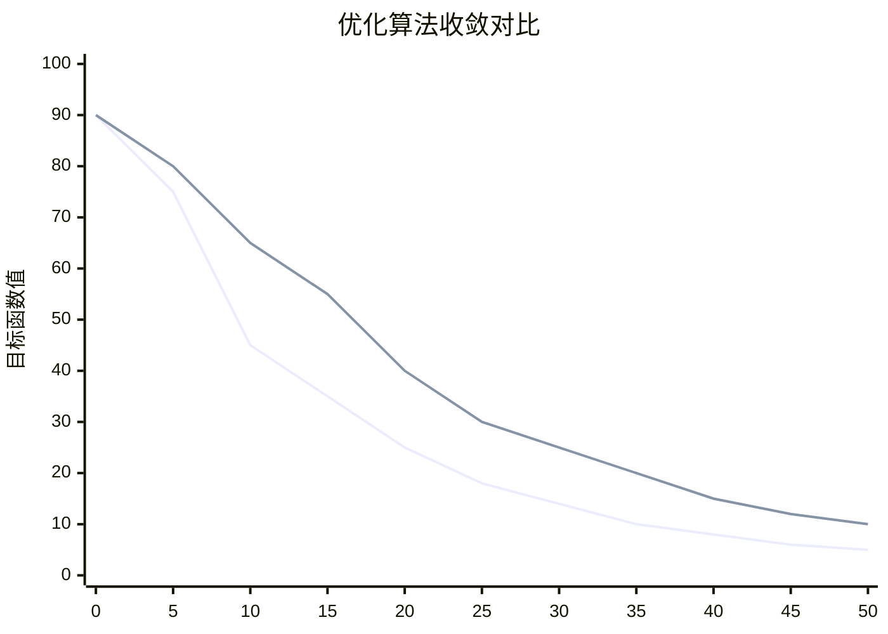

# 数学建模论文绘图指南

数学建模论文中的图表和可视化是表达模型结构、分析结果和展示数据的重要手段。本指南介绍多种绘图方法，从传统方法到现代工具，帮助团队制作高质量的图表。

## 一、基础绘图原则

无论使用什么工具，以下原则对于创建有效的图表至关重要：

1. **清晰性**：图表应当简洁明了，避免视觉混乱
2. **一致性**：在整篇论文中保持风格一致（字体、颜色、标记等）
3. **信息量**：图表应该传达有价值的信息，避免"图表垃圾"
4. **独立性**：图表应当具有自解释性，配有清晰的标题和图例
5. **准确性**：确保数据表示准确，避免视觉扭曲

## 二、Python绘图工具

### 1. Matplotlib（基础通用）

```python
import matplotlib.pyplot as plt
import numpy as np

# 创建数据
x = np.linspace(0, 10, 100)
y1 = np.sin(x)
y2 = np.cos(x)

# 创建图表
plt.figure(figsize=(10, 6))
plt.plot(x, y1, 'b-', label='sin(x)')
plt.plot(x, y2, 'r--', label='cos(x)')
plt.xlabel('x轴')
plt.ylabel('y轴')
plt.title('正弦和余弦函数')
plt.grid(True)
plt.legend()
plt.savefig('trig_functions.png', dpi=300)
plt.show()
```

常用图表类型：
- 折线图：`plt.plot()`
- 散点图：`plt.scatter()`
- 柱状图：`plt.bar()`
- 直方图：`plt.hist()`
- 饼图：`plt.pie()`
- 箱线图：`plt.boxplot()`
- 热力图：`plt.imshow()`

### 2. Seaborn（统计可视化）

```python
import seaborn as sns
import pandas as pd
import numpy as np

# 创建数据
data = pd.DataFrame({
    'x': np.random.normal(0, 1, 1000),
    'y': np.random.normal(0, 1, 1000),
    'category': np.random.choice(['A', 'B', 'C'], 1000)
})

# 创建图表
plt.figure(figsize=(10, 8))
sns.set_theme(style="whitegrid")
sns.scatterplot(x='x', y='y', hue='category', data=data)
plt.title('分类散点图')
plt.savefig('seaborn_scatter.png', dpi=300)
plt.show()

# 创建成对关系图
sns.pairplot(data, hue='category')
plt.savefig('pairplot.png', dpi=300)
plt.show()

# 创建热力图
corr = data.corr()
sns.heatmap(corr, annot=True, cmap='coolwarm')
plt.title('相关性热力图')
plt.savefig('heatmap.png', dpi=300)
plt.show()
```

Seaborn特点：
- 美观的默认样式
- 内置调色板
- 支持多变量可视化
- 统计估计和置信区间

### 3. Plotly（交互式可视化）

```python
import plotly.express as px
import plotly.graph_objects as go
import pandas as pd
import numpy as np

# 创建数据
df = pd.DataFrame({
    'x': np.linspace(0, 10, 100),
    'y': np.sin(np.linspace(0, 10, 100)),
    'size': np.random.randint(5, 20, 100)
})

# 创建交互式散点图
fig = px.scatter(df, x='x', y='y', size='size', color='size',
                 title='交互式散点图')
fig.write_html('interactive_scatter.html')  # 保存为HTML以保持交互性
fig.write_image('scatter_plotly.png')  # 也可保存为静态图片

# 创建3D图表
z = np.outer(np.sin(np.linspace(0, 10, 50)), np.cos(np.linspace(0, 10, 50)))
fig = go.Figure(data=[go.Surface(z=z)])
fig.update_layout(title='3D曲面图', autosize=False,
                  width=800, height=600)
fig.write_html('surface_3d.html')
```

Plotly优点：
- 完全交互式图表
- 可导出为HTML，保持交互性
- 支持复杂的3D可视化
- 可创建仪表板

### 4. Altair（声明式可视化）

```python
import altair as alt
import pandas as pd
import numpy as np

# 创建数据
data = pd.DataFrame({
    'x': np.arange(100),
    'y': np.random.normal(0, 10, 100).cumsum(),
    'category': np.random.choice(['A', 'B', 'C'], 100)
})

# 创建基本图表
chart = alt.Chart(data).mark_line().encode(
    x='x',
    y='y',
    color='category'
).properties(
    title='Altair线图示例',
    width=600,
    height=400
)

# 保存图表
chart.save('altair_chart.html')
chart.save('altair_chart.png')

# 创建交互式选择图表
brush = alt.selection_interval()
points = alt.Chart(data).mark_point().encode(
    x='x',
    y='y',
    color=alt.condition(brush, 'category', alt.value('gray'))
).add_selection(brush)

bars = alt.Chart(data).mark_bar().encode(
    y='category',
    x='count()',
    color='category'
).transform_filter(brush)

(points & bars).save('altair_interactive.html')
```

Altair优点：
- 声明式语法，简洁直观
- 基于Vega-Lite
- 易于创建交互式图表
- 良好的组合性

## 三、传统绘图工具

### 1. Excel绘图

虽然不是最先进的选择，但Excel仍是快速创建基本图表的实用工具：

1. 在Excel中输入数据
2. 选择数据区域
3. 插入 -> 图表 -> 选择图表类型
4. 自定义图表样式和标签
5. 右键图表 -> 另存为图片

优点：
- 易于使用，无需编程
- 可快速创建标准图表
- 交互式编辑界面

缺点：
- 自定义选项有限
- 不适合复杂可视化
- 样式不够专业

### 2. Origin（专业科学绘图）

Origin是一款专业的科学绘图软件，广泛用于学术论文：

1. 导入或输入数据
2. 选择绘图类型
3. 自定义图表外观
4. 进行数据分析和拟合
5. 导出高质量图像

优点：
- 专业的科学绘图工具
- 强大的数据分析功能
- 高度可定制
- 产生出版级质量图表

缺点：
- 商业软件，需要购买
- 学习曲线较陡峭
- 不如编程方法灵活

## 四、LaTeX绘图工具

### 1. TikZ/PGF（矢量图形）

TikZ是LaTeX中最强大的绘图包，适合创建精确的数学图表：

```latex
\documentclass{article}
\usepackage{tikz}
\usetikzlibrary{arrows,shapes,positioning,shadows,trees}

\begin{document}

\begin{tikzpicture}
    % 绘制坐标轴
    \draw[thick,->] (0,0) -- (4,0) node[anchor=north west] {$x$};
    \draw[thick,->] (0,0) -- (0,4) node[anchor=south east] {$y$};
    
    % 绘制函数曲线
    \draw[scale=0.5,domain=0:6,smooth,variable=\x,blue] 
        plot ({\x},{0.5*\x*\x});
    
    % 添加标注
    \node at (2,2) {$f(x) = \frac{1}{2}x^2$};
\end{tikzpicture}

\end{document}
```

优点：
- 完美集成到LaTeX文档
- 高质量矢量图形
- 精确的数学绘图
- 可编程性强

缺点：
- 学习曲线陡峭
- 复杂图形需要大量代码
- 不适合数据密集型可视化

### 2. PGFPlots（数据可视化）

PGFPlots是基于TikZ的科学绘图包：

```latex
\documentclass{article}
\usepackage{pgfplots}
\pgfplotsset{width=10cm,compat=1.16}

\begin{document}

\begin{tikzpicture}
\begin{axis}[
    title={优化过程收敛曲线},
    xlabel={迭代次数},
    ylabel={目标函数值},
    xmin=0, xmax=50,
    ymin=0, ymax=100,
    legend pos=north east,
    grid=both
]

\addplot[color=blue,mark=*]
    coordinates {
    (0,90)(5,75)(10,45)(15,35)(20,25)(25,18)(30,14)(35,10)(40,8)(45,6)(50,5)
    };
\addlegendentry{算法A}

\addplot[color=red,mark=square]
    coordinates {
    (0,90)(5,80)(10,65)(15,55)(20,40)(25,30)(30,25)(35,20)(40,15)(45,12)(50,10)
    };
\addlegendentry{算法B}

\end{axis}
\end{tikzpicture}

\end{document}
```

优点：
- 专为科学数据可视化设计
- 自动生成坐标轴和图例
- 支持多种图表类型
- 集成到LaTeX工作流

缺点：
- 不适合大数据集
- 编译时间长
- 调试困难

## 五、Mermaid图表（代码生成图表）

Mermaid是一种基于文本的图表生成工具，可以直接在Markdown中使用：

### 1. 流程图



### 2. 序列图



### 3. 类图



### 4. 甘特图



### 5. 状态图



Mermaid优点：
- 直接在Markdown中使用
- 基于文本，易于版本控制
- 自动生成多种图表
- 无需专业绘图工具

缺点：
- 自定义选项有限
- 不适合复杂的数据可视化
- 样式选项较少

## 六、专业绘图工具

### 1. Visio（流程图和示意图）

Microsoft Visio是创建流程图、组织结构图和技术图表的专业工具：

1. 使用预定义形状和连接器
2. 拖放创建图表
3. 自定义外观和样式
4. 导出为高质量图像

优点：
- 专业的流程图和示意图工具
- 丰富的模板和形状库
- 易于使用的拖放界面

缺点：
- 商业软件，需要购买
- 不适合数据可视化
- 不如编程方法灵活

### 2. Draw.io（在线绘图）

Draw.io是一款免费的在线绘图工具，可创建各种图表：

1. 访问[draw.io](https://app.diagrams.net/)
2. 选择保存位置（本地、Google Drive等）
3. 使用拖放界面创建图表
4. 导出为PNG、SVG或PDF

优点：
- 免费且易于使用
- 支持多种图表类型
- 可与云存储集成
- 支持协作

缺点：
- 高级功能有限
- 不适合数据密集型可视化

### 3. Graphviz（自动布局图）

Graphviz是一款使用DOT语言描述图形的开源工具：


使用方法：
1. 安装Graphviz
2. 创建DOT文件
3. 使用命令生成图像：`dot -Tpng graph.dot -o graph.png`

优点：
- 自动处理节点布局
- 适合复杂网络和流程图
- 基于文本，易于版本控制

缺点：
- 学习曲线较陡峭
- 精确控制布局困难
- 不适合数据可视化

## 七、论文图表最佳实践

### 1. 图表选择指南

| 数据类型 | 推荐图表类型 | 推荐工具 |
|---------|------------|---------|
| 时间序列 | 折线图 | Matplotlib, Plotly |
| 分类比较 | 柱状图, 箱线图 | Seaborn, Excel |
| 分布情况 | 直方图, 密度图 | Seaborn, Matplotlib |
| 相关性 | 散点图, 热力图 | Seaborn, Plotly |
| 比例关系 | 饼图, 堆叠图 | Matplotlib, Excel |
| 地理数据 | 地图, 等值线图 | Plotly, GIS工具 |
| 网络关系 | 网络图 | NetworkX, Graphviz |
| 算法流程 | 流程图 | Mermaid, TikZ |
| 系统架构 | 框图, UML图 | Mermaid, Draw.io |
| 数学关系 | 函数图 | PGFPlots, Matplotlib |

### 2. 图表优化技巧

1. **颜色选择**
   - 使用对比度高的颜色
   - 考虑色盲友好的调色板
   - 保持一致的颜色方案
   - 避免使用过多颜色（通常5-7种为宜）

2. **文字处理**
   - 使用清晰可读的字体（如Arial、Times New Roman）
   - 标题和轴标签大小适中（10-12pt）
   - 避免文字重叠或截断
   - 确保中文字体正确显示

3. **布局优化**
   - 保持适当的宽高比
   - 避免过度拥挤
   - 合理使用空白空间
   - 对齐多个子图

4. **数据表示**
   - 选择合适的数据范围
   - 考虑对数或其他变换
   - 标记重要数据点
   - 显示误差线或置信区间

### 3. 图表导出与插入

1. **文件格式选择**
   - 矢量格式（PDF, SVG, EPS）用于线条图和示意图
   - 位图格式（PNG）用于照片和渲染图
   - 避免使用JPEG（会产生压缩伪影）

2. **分辨率设置**
   - 学术出版通常需要300-600 DPI
   - 确保文字在高分辨率下仍清晰可读
   - 测试打印效果

3. **LaTeX插入技巧**
   ```latex
   \begin{figure}[htbp]
       \centering
       \includegraphics[width=0.8\textwidth]{figure_name.pdf}
       \caption{图表说明文字}
       \label{fig:identifier}
   \end{figure}
   ```

4. **Word插入技巧**
   - 使用"插入" -> "图片"
   - 设置文字环绕方式
   - 使用"定位点"确保图表位置稳定
   - 添加题注

## 八、综合案例：多方法绘制同一图表

以下是使用不同工具绘制优化算法收敛曲线的示例：

### 1. Python (Matplotlib)

```python
import matplotlib.pyplot as plt
import numpy as np

# 数据
iterations = np.arange(0, 51, 5)
algo_a = [90, 75, 45, 35, 25, 18, 14, 10, 8, 6, 5]
algo_b = [90, 80, 65, 55, 40, 30, 25, 20, 15, 12, 10]

plt.figure(figsize=(10, 6))
plt.plot(iterations, algo_a, 'bo-', label='算法A')
plt.plot(iterations, algo_b, 'rs-', label='算法B')
plt.xlabel('迭代次数')
plt.ylabel('目标函数值')
plt.title('优化算法收敛对比')
plt.grid(True)
plt.legend()
plt.savefig('convergence_matplotlib.png', dpi=300)
plt.show()
```

### 2. Python (Plotly)

```python
import plotly.graph_objects as go
import numpy as np

# 数据
iterations = np.arange(0, 51, 5)
algo_a = [90, 75, 45, 35, 25, 18, 14, 10, 8, 6, 5]
algo_b = [90, 80, 65, 55, 40, 30, 25, 20, 15, 12, 10]

fig = go.Figure()
fig.add_trace(go.Scatter(x=iterations, y=algo_a, 
                         mode='lines+markers',
                         name='算法A'))
fig.add_trace(go.Scatter(x=iterations, y=algo_b, 
                         mode='lines+markers',
                         name='算法B'))
fig.update_layout(
    title='优化算法收敛对比',
    xaxis_title='迭代次数',
    yaxis_title='目标函数值',
    template='plotly_white'
)
fig.write_html('convergence_plotly.html')
fig.write_image('convergence_plotly.png')
```

### 3. LaTeX (PGFPlots)

```latex
\begin{tikzpicture}
\begin{axis}[
    title={优化算法收敛对比},
    xlabel={迭代次数},
    ylabel={目标函数值},
    xmin=0, xmax=50,
    ymin=0, ymax=100,
    legend pos=north east,
    grid=both
]

\addplot[color=blue,mark=*]
    coordinates {
    (0,90)(5,75)(10,45)(15,35)(20,25)(25,18)(30,14)(35,10)(40,8)(45,6)(50,5)
    };
\addlegendentry{算法A}

\addplot[color=red,mark=square]
    coordinates {
    (0,90)(5,80)(10,65)(15,55)(20,40)(25,30)(30,25)(35,20)(40,15)(45,12)(50,10)
    };
\addlegendentry{算法B}

\end{axis}
\end{tikzpicture}
```

### 4. Mermaid



## 总结

选择合适的绘图工具应基于以下因素：
1. 图表类型和复杂度
2. 数据规模和格式
3. 个人或团队的技术熟悉度
4. 可用时间和资源
5. 对交互性和可复用性的需求

对于数学建模论文，建议：
- 使用Python（Matplotlib/Seaborn）绘制数据可视化图表
- 使用Mermaid或Draw.io绘制流程图和结构图
- 对于要求特别高的出版物，考虑使用TikZ/PGFPlots
- 保存高分辨率图片，并在论文中正确引用

不断实践和改进绘图技巧，将使你的数学建模论文更加专业和有说服力！ 