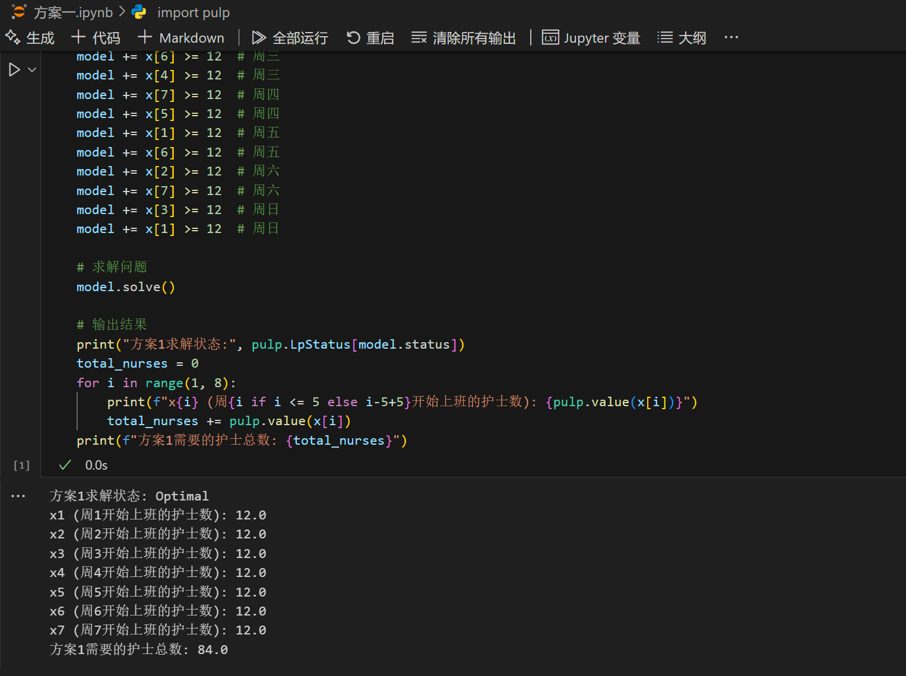
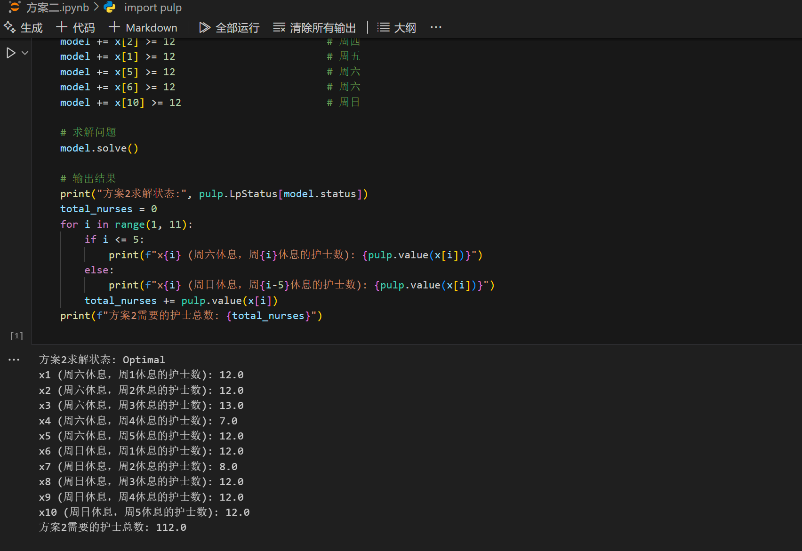
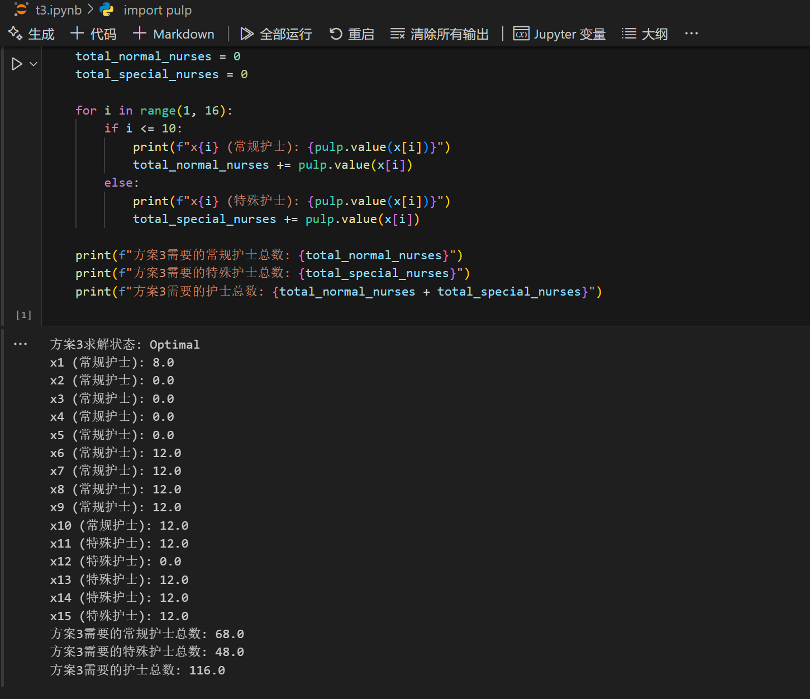

# 数学建模实验报告
---

| 姓名   | 郝玉龙          |
|:--------:|:-------------:|
| 班级   | 2306班   |
| 学号   | U202317346 |
|  电话  | 13986339770      |

---

## 一、背景与问题

某医院每天各时间段内需要的值班护士数如表1所示：

| 时间区段         | 护士数量 |
|:----------------:|:--------:|
| 6:00~10:00      | 18       |
| 10:00~14:00     | 20       |
| 14:00~18:00     | 19       |
| 18:00~22:00     | 17       |
| 22:00~6:00（次日）| 12       |

该医院护士上班分五个班次，每班8小时，具体上班时间为：

- 第一班：2:00~10:00
- 第二班：6:00~14:00
- 第三班：10:00~18:00
- 第四班：14:00~22:00
- 第五班：18:00~2:00（次日）

每名护士每周上5个班，并被安排在不同的日子，由一名总护士长负责护士的值班安排。值班方案要做到在人员或经济上比较节省，又做到尽可能合情合理。下面是一些正在考虑中的值班方案：

### 【方案1】

每名护士连续上班5天，休息2天，并从上班第一天起按从第一班到第五班顺序安排。

### 【方案2】

考虑到方案1中每名护士在周末（周六、周日）两天内休息安排不均匀，于是规定每名护士在周六、周日两天内安排一天、且只安排一天休息，再在周一至周五期间安排4个班，同样上班的5天内分别顺序安排5个不同班次。

在对方案1、2建立线性规划模型并求解后发现，方案2虽然在安排周末休息上比较合理，但所需值班人员要比方案1有较多增加，经济上不太合算，于是又提出了第3方案。

### 【方案3】

在方案2的基础上，动员一部分护士放弃周末休息，即每周在周一至周五间由总护士长给安排三天值班，加周六周日共上五个班，同样五个班分别安排不同班次。作为奖励，规定放弃周末休息的护士，其工资和奖金总额比其他护士增加a%。

---

### 任务

根据上述方案，帮助总护士长分析研究：

1. 对方案1、2建立使值班护士人数为最少的线性规划模型并求解。
2. 对方案3，同样建立使值班护士人数为最少的线性规划模型并求解，然后回答a的值为多大时，第3方案较第2方案更经济。


# 方案一


## 决策变量

$x_i$：表示从周$i$开始上班的护士数量，其中$i=1,2,3,4,5,6,7$分别对应周一到周日。

## 目标函数

最小化所需护士总数：

$$\min \sum_{i=1}^{7} x_i$$

## 约束条件

### 1. 各时间段护士数量约束

对于每一天$d$（$d=1,2,3,4,5,6,7$，对应周一到周日）和每个时间段$t$（$t$为"6:00-10:00"、"10:00-14:00"、"14:00-18:00"、"18:00-22:00"、"22:00-6:00"），需要满足：

$$\sum_{i=1}^{7} a_{i,d,t} \cdot x_i \geq N_t$$

其中：
- $a_{i,d,t}$：表示从周$i$开始上班的护士在$d$日$t$时间段是否工作（1表示工作，0表示不工作）
- $N_t$：$t$时间段所需的最少护士数量

### 2. 非负约束

$$x_i \geq 0, \quad \forall i=1,2,\ldots,7$$

## 护士工作时间判断函数

对于从周$i$开始上班的护士，判断其在$d$日$t$时间段是否工作的函数$a_{i,d,t}$定义如下：

$$a_{i,d,t} = \begin{cases}
1, & \text{如果从周}i\text{开始上班的护士在}d\text{日}t\text{时间段工作} \\
0, & \text{否则}
\end{cases}$$

其中，判断从周$i$开始上班的护士在$d$日$t$时间段是否工作的逻辑为：

1. 确定护士的工作日：
   - 从周$i$开始连续工作5天，休息2天
   - 工作日 = 周$i$到周$(i+4)$（如果超过7，则取模）

2. 确定护士的工作班次：
   - 对于每个工作日$d$，计算从周$i$开始上班的第几天
   - 第$j$天对应第$j$个班次（$j=1,2,3,4,5$）

3. 判断班次是否覆盖时间段$t$：
   - 如果$t$为"6:00-10:00"且班次为1或2，则覆盖
   - 如果$t$为"10:00-14:00"且班次为2或3，则覆盖
   - 如果$t$为"14:00-18:00"且班次为3或4，则覆盖
   - 如果$t$为"18:00-22:00"且班次为4或5，则覆盖
   - 如果$t$为"22:00-6:00"且班次为5或1，则覆盖

4. 特殊处理夜班跨越午夜的情况：
   - 如果$t$为"22:00-6:00"，且护士在前一天工作，且前一天是第5班（18:00-2:00），则护士在休息日的凌晨（0:00-2:00）仍然在工作

## 具体约束条件

根据上述模型，我们可以得到以下具体约束条件：

### 6:00-10:00 时间段的约束
- 周一：$x_1 + x_7 \geq 18$
- 周二：$x_2 + x_1 \geq 18$
- 周三：$x_3 + x_2 \geq 18$
- 周四：$x_4 + x_3 \geq 18$
- 周五：$x_5 + x_4 \geq 18$
- 周六：$x_6 + x_5 \geq 18$
- 周日：$x_7 + x_6 \geq 18$

### 10:00-14:00 时间段的约束
- 周一：$x_1 + x_6 \geq 20$
- 周二：$x_1 + x_7 \geq 20$
- 周三：$x_1 + x_2 \geq 20$
- 周四：$x_3 + x_2 \geq 20$
- 周五：$x_4 + x_3 \geq 20$
- 周六：$x_5 + x_4 \geq 20$
- 周日：$x_6 + x_5 \geq 20$

### 14:00-18:00 时间段的约束
- 周一：$x_6 + x_5 \geq 19$
- 周二：$x_7 + x_6 \geq 19$
- 周三：$x_1 + x_7 \geq 19$
- 周四：$x_2 + x_1 \geq 19$
- 周五：$x_3 + x_2 \geq 19$
- 周六：$x_4 + x_3 \geq 19$
- 周日：$x_5 + x_4 \geq 19$

### 18:00-22:00 时间段的约束
- 周一：$x_5 + x_4 \geq 17$
- 周二：$x_6 + x_5 \geq 17$
- 周三：$x_7 + x_6 \geq 17$
- 周四：$x_1 + x_7 \geq 17$
- 周五：$x_2 + x_1 \geq 17$
- 周六：$x_3 + x_2 \geq 17$
- 周日：$x_4 + x_3 \geq 17$

### 22:00-6:00 时间段的约束
- 周一：$x_4 \geq 12$, $x_2 \geq 12$
- 周二：$x_5 \geq 12$, $x_3 \geq 12$
- 周三：$x_6 \geq 12$, $x_4 \geq 12$
- 周四：$x_7 \geq 12$, $x_5 \geq 12$
- 周五：$x_1 \geq 12$, $x_6 \geq 12$
- 周六：$x_2 \geq 12$, $x_7 \geq 12$
- 周日：$x_3 \geq 12$, $x_1 \geq 12$

## 分析：
设从周一到周日开始的值班护士人数为x1,x2,x3,x4,x5,x6,x7
则排班需要满足：

| 班次 / 星期 | 一 | 二 | 三 | 四 | 五 | 六 | 日 |
|------------|---|---|---|---|---|---|---|
| 6:00-10:00 | x1+x7>=18 | x2+x1>=18 | x3+x2>=18 | x4+x3>=18 | x5+x4>=18 | x6+x5>=18 | x7+x6>=18 |
| 10:00-14:00 | x1+x6>=20 | x1+x7>=20 | x1+x2>=20 | x3+x2>=20 | x4+x3>=20 | x5+x4>=20 | x6+x5>=20 |
| 14:00-18:00 | x6+x5>=19 | x7+x6>=19 | x1+x7>=19 | x2+x1>=19 | x3+x2>=19 | x4+x3>=19 | x5+x4>=19 |
| 18:00-22:00 | x5+x4>=17 | x6+x5>=17 | x7+x6>=17 | x1+x7>=17 | x2+x1>=17 | x3+x2>=17 | x4+x3>=17 |
| 22:00-6:00 | x4>=12, x2>=12 | x5>=12, x3>=12 | x6>=12, x4>=12 | x7>=12, x5>=12 | x1>=12, x6>=12 | x2>=12, x7>=12 | x3>=12, x1>=12 |

## 求解代码

```python
import pulp

# 创建问题
model = pulp.LpProblem(name="nurse-scheduling-plan1", sense=pulp.LpMinimize)

# 决策变量：x1到x7表示周一到周日开始上班的护士数量
x = {i: pulp.LpVariable(f"x{i}", lowBound=0, cat=pulp.LpInteger) for i in range(1, 8)}

# 目标函数：最小化所需护士总数
model += sum(x.values())

# 约束条件
# 6:00-10:00 时间段的约束
model += x[1] + x[7] >= 18  # 周一
model += x[2] + x[1] >= 18  # 周二
model += x[3] + x[2] >= 18  # 周三
model += x[4] + x[3] >= 18  # 周四
model += x[5] + x[4] >= 18  # 周五
model += x[6] + x[5] >= 18  # 周六
model += x[7] + x[6] >= 18  # 周日

# 10:00-14:00 时间段的约束
model += x[1] + x[6] >= 20  # 周一
model += x[1] + x[7] >= 20  # 周二
model += x[1] + x[2] >= 20  # 周三
model += x[3] + x[2] >= 20  # 周四
model += x[4] + x[3] >= 20  # 周五
model += x[5] + x[4] >= 20  # 周六
model += x[6] + x[5] >= 20  # 周日

# 14:00-18:00 时间段的约束
model += x[6] + x[5] >= 19  # 周一
model += x[7] + x[6] >= 19  # 周二
model += x[1] + x[7] >= 19  # 周三
model += x[2] + x[1] >= 19  # 周四
model += x[3] + x[2] >= 19  # 周五
model += x[4] + x[3] >= 19  # 周六
model += x[5] + x[4] >= 19  # 周日

# 18:00-22:00 时间段的约束
model += x[5] + x[4] >= 17  # 周一
model += x[6] + x[5] >= 17  # 周二
model += x[7] + x[6] >= 17  # 周三
model += x[1] + x[7] >= 17  # 周四
model += x[2] + x[1] >= 17  # 周五
model += x[3] + x[2] >= 17  # 周六
model += x[4] + x[3] >= 17  # 周日

# 22:00-6:00 时间段的约束
model += x[4] >= 12  # 周一
model += x[2] >= 12  # 周一
model += x[5] >= 12  # 周二
model += x[3] >= 12  # 周二
model += x[6] >= 12  # 周三
model += x[4] >= 12  # 周三
model += x[7] >= 12  # 周四
model += x[5] >= 12  # 周四
model += x[1] >= 12  # 周五
model += x[6] >= 12  # 周五
model += x[2] >= 12  # 周六
model += x[7] >= 12  # 周六
model += x[3] >= 12  # 周日
model += x[1] >= 12  # 周日

# 求解问题
model.solve()

# 输出结果
print("方案1求解状态:", pulp.LpStatus[model.status])
total_nurses = 0
for i in range(1, 8):
    print(f"x{i} (周{i if i <= 5 else i-5+5}开始上班的护士数): {pulp.value(x[i])}")
    total_nurses += pulp.value(x[i])
print(f"方案1需要的护士总数: {total_nurses}")
```

## 求解结果

运行方案一的代码后，我们可以得到：
- 方案1求解状态: Optimal
- x1 (周1开始上班的护士数): 12.0
- x2 (周2开始上班的护士数): 12.0
- x3 (周3开始上班的护士数): 12.0
- x4 (周4开始上班的护士数): 12.0
- x5 (周5开始上班的护士数): 12.0
- x6 (周6开始上班的护士数): 12.0
- x7 (周7开始上班的护士数): 12.0
- 方案1需要的护士总数: 84.0



# 方案二

## 决策变量

$x_i$：表示选择在周六休息且在周一至周五中的第$i$天休息的护士数量，其中$i=1,2,3,4,5$。
$y_i$：表示选择在周日休息且在周一至周五中的第$i$天休息的护士数量，其中$i=1,2,3,4,5$。

为简化表示，我们用变量组：
- $x_1, x_2, x_3, x_4, x_5$ 表示周六休息的五类护士
- $x_6, x_7, x_8, x_9, x_{10}$ 表示周日休息的五类护士（实际对应于 $y_1, y_2, y_3, y_4, y_5$）

## 目标函数

最小化所需护士总数：

$$\min \sum_{i=1}^{10} x_i$$

## 约束条件

根据排班规则，每名护士每周工作5天，在周一至周五中休息1天，在周六和周日中休息1天。工作的5天内按从第一班到第五班的顺序安排。

### 6:00-10:00 时间段的约束
- 周一：$x_{10} + x_6 \geq 18$
- 周二：$x_1 + x_5 + x_9 + x_{10} \geq 18$
- 周三：$x_4 + x_8 + x_5 + x_9 \geq 18$
- 周四：$x_3 + x_7 + x_4 + x_8 \geq 18$
- 周五：$x_2 + x_6 + x_3 + x_7 \geq 18$
- 周六：$x_1 + x_2 + x_6 + x_{10} \geq 18$
- 周日：$x_6 + x_7 + x_8 + x_9 \geq 18$

### 10:00-14:00 时间段的约束
- 周一：$x_6 + x_7 + x_8 + x_9 \geq 20$
- 周二：$x_1 + x_2 + x_6 + x_{10} \geq 20$
- 周三：$x_1 + x_5 + x_9 + x_{10} \geq 20$
- 周四：$x_4 + x_8 + x_5 + x_9 \geq 20$
- 周五：$x_3 + x_7 + x_4 + x_8 \geq 20$
- 周六：$x_2 + x_3 + x_7 + x_8 \geq 20$
- 周日：$x_7 + x_8 + x_9 + x_{10} \geq 20$

### 14:00-18:00 时间段的约束
- 周一：$x_7 + x_8 + x_9 + x_{10} \geq 19$
- 周二：$x_2 + x_6 + x_3 + x_7 \geq 19$
- 周三：$x_1 + x_2 + x_6 + x_{10} \geq 19$
- 周四：$x_1 + x_5 + x_9 + x_{10} \geq 19$
- 周五：$x_4 + x_8 + x_5 + x_9 \geq 19$
- 周六：$x_3 + x_4 + x_8 + x_9 \geq 19$
- 周日：$x_8 + x_9 + x_{10} + x_6 \geq 19$

### 18:00-22:00 时间段的约束
- 周一：$x_8 + x_9 + x_{10} + x_6 \geq 17$
- 周二：$x_3 + x_7 + x_4 + x_8 \geq 17$
- 周三：$x_2 + x_6 + x_3 + x_7 \geq 17$
- 周四：$x_1 + x_2 + x_6 + x_{10} \geq 17$
- 周五：$x_5 + x_9 + x_1 + x_{10} \geq 17$
- 周六：$x_4 + x_5 + x_9 + x_{10} \geq 17$
- 周日：$x_9 + x_{10} + x_6 + x_7 \geq 17$

### 22:00-6:00 时间段的约束
- 周一：$x_9 \geq 12$，$x_5 + x_9 \geq 12$
- 周二：$x_4 + x_8 \geq 12$，$x_{10} + x_4 \geq 12$
- 周三：$x_3 + x_7 \geq 12$，$x_5 + x_3 \geq 12$
- 周四：$x_2 + x_6 \geq 12$，$x_4 + x_2 \geq 12$
- 周五：$x_1 + x_{10} \geq 12$，$x_3 + x_1 \geq 12$
- 周六：$x_5 \geq 12$，$x_2 \geq 12$
- 周日：$x_{10} \geq 12$，$x_1 \geq 12$

### 非负约束
$$x_i \geq 0, \quad \forall i=1,2,\ldots,10$$

## 求解代码

```python
import pulp

# 创建问题
model = pulp.LpProblem(name="nurse-scheduling-plan2", sense=pulp.LpMinimize)

# 决策变量：x1到x10表示不同休息组合的护士数量
# x1到x5: 周六休息，周一至周五中某一天休息的护士数量
# x6到x10: 周日休息，周一至周五中某一天休息的护士数量
x = {i: pulp.LpVariable(f"x{i}", lowBound=0, cat=pulp.LpInteger) for i in range(1, 11)}

# 目标函数：最小化所需护士总数
model += sum(x.values())

# 约束条件
# 6:00-10:00 时间段的约束
model += x[10] + x[6] >= 18                 # 周一
model += x[1] + x[5] + x[9] + x[10] >= 18   # 周二
model += x[4] + x[8] + x[5] + x[9] >= 18    # 周三
model += x[3] + x[7] + x[4] + x[8] >= 18    # 周四
model += x[2] + x[3] >= 18                  # 周五
model += x[1] + x[2] >= 18                  # 周六
model += x[6] + x[7] >= 18                  # 周日

# 10:00-14:00 时间段的约束
model += x[6] + x[7] >= 20                  # 周一
model += x[1] + x[2] + x[6] + x[10] >= 20   # 周二
model += x[1] + x[5] + x[9] + x[10] >= 20   # 周三
model += x[4] + x[8] + x[5] + x[9] >= 20    # 周四
model += x[3] + x[4] >= 20                  # 周五
model += x[2] + x[3] >= 20                  # 周六
model += x[7] + x[8] >= 20                  # 周日

# 14:00-18:00 时间段的约束
model += x[7] + x[8] >= 19                  # 周一
model += x[2] + x[6] + x[3] + x[7] >= 19    # 周二
model += x[1] + x[2] + x[6] + x[10] >= 19   # 周三
model += x[1] + x[5] + x[9] + x[10] >= 19   # 周四
model += x[4] + x[5] >= 19                  # 周五
model += x[3] + x[4] >= 19                  # 周六
model += x[8] + x[9] >= 19                  # 周日

# 18:00-22:00 时间段的约束
model += x[8] + x[9] >= 17                  # 周一
model += x[3] + x[7] + x[4] + x[8] >= 17    # 周二
model += x[2] + x[6] + x[3] + x[7] >= 17    # 周三
model += x[1] + x[3] + x[6] + x[10] >= 17   # 周四
model += x[5] + x[1] >= 17                  # 周五
model += x[4] + x[5] >= 17                  # 周六
model += x[9] + x[10] >= 17                 # 周日

# 22:00-6:00 时间段的约束
model += x[9] >= 12                         # 周一
model += x[5] + x[9] >= 12                  # 周一
model += x[4] + x[8] >= 12                  # 周二
model += x[3] + x[7] >= 12                  # 周三
model += x[3] + x[6] >= 12                  # 周四
model += x[2] >= 12                         # 周四
model += x[1] >= 12                         # 周五
model += x[5] >= 12                         # 周六
model += x[6] >= 12                         # 周六
model += x[10] >= 12                        # 周日

# 求解问题
model.solve()

# 输出结果
print("方案2求解状态:", pulp.LpStatus[model.status])
total_nurses = 0
for i in range(1, 11):
    if i <= 5:
        print(f"x{i} (周六休息，周{i}休息的护士数): {pulp.value(x[i])}")
    else:
        print(f"x{i} (周日休息，周{i-5}休息的护士数): {pulp.value(x[i])}")
    total_nurses += pulp.value(x[i])
print(f"方案2需要的护士总数: {total_nurses}")
```

## 求解结果

运行方案二的代码后，我们可以得到：
- 方案2求解状态: Optimal
- x1 (周六休息，周1休息的护士数): 12.0
- x2 (周六休息，周2休息的护士数): 12.0
- x3 (周六休息，周3休息的护士数): 13.0
- x4 (周六休息，周4休息的护士数): 7.0
- x5 (周六休息，周5休息的护士数): 12.0
- x6 (周日休息，周1休息的护士数): 12.0
- x7 (周日休息，周2休息的护士数): 8.0
- x8 (周日休息，周3休息的护士数): 12.0
- x9 (周日休息，周4休息的护士数): 12.0
- x10 (周日休息，周5休息的护士数): 12.0
- 方案2需要的护士总数: 112.0
  

# 方案三

## 决策变量

方案三包含两类护士：
1. 常规护士：与方案二相同，在周一至周五休息一天，周六或周日休息一天
2. 特殊护士：在周一至周五休息两天，周六和周日都工作

定义决策变量：
- $x_1$ 到 $x_{10}$：表示常规护士（与方案二相同）
- $x_{11}$ 到 $x_{15}$：表示特殊护士（周六日都工作，在周一至周五中休息两天）

## 目标函数

最小化等效护士成本（考虑工资增加a%）：

$$\min \sum_{i=1}^{10} x_i + (1+a\%) \sum_{i=11}^{15} x_i$$

由于a是待定值，我们可以先求解最小化总护士数的问题：

$$\min \sum_{i=1}^{15} x_i$$

然后利用结果计算a的临界值。

## 约束条件

### 6:00-10:00 时间段的约束
- 周一：$x_4 + x_5 + x_{11} + x_{15} \geq 18$
- 周二：$x_1 + x_5 + x_{11} + x_{12} \geq 20$
- 周三：$x_4 + x_5 + x_6 + x_7 + x_{11} + x_{15} \geq 20$
- 周四：$x_1 + x_5 + x_7 + x_8 + x_{11} + x_{12} \geq 19$
- 周五：$x_3 + x_4 + x_6 + x_{10} + x_{14} + x_{15} \geq 20$
- 周六：$x_9 + x_{10} + x_{13} + x_{14} \geq 20$
- 周日：$x_6 + x_{10} + x_{14} + x_{15} \geq 19$

### 10:00-14:00 时间段的约束
- 周一：$x_6 + x_7 + x_{11} + x_{15} \geq 17$
- 周二：$x_7 + x_8 \geq 18$
- 周三：$x_8 + x_9 \geq 20$
- 周四：$x_9 + x_{10} \geq 19$
- 周五：$x_6 + x_{10} \geq 17$
- 周六：$x_1 + x_2 + x_6 + x_7 \geq 18$
- 周日：$x_2 + x_3 + x_7 + x_8 \geq 20$

### 14:00-18:00 时间段的约束
- 周一：$x_1 + x_2 + x_{12} + x_{13} \geq 20$
- 周二：$x_2 + x_3 + x_{13} + x_{14} \geq 19$
- 周三：$x_3 + x_4 + x_{14} + x_{15} \geq 17$
- 周四：$x_8 + x_{12} \geq 12$
- 周五：$x_5 + x_{11} \geq 12$
- 周六：$x_3 + x_{14} \geq 12$
- 周日：$x_2 + x_9 + x_{13} \geq 12$

### 18:00-22:00 时间段的约束
- 周一：$x_5 + x_{10} \geq 12$
- 周二：$x_4 + x_{15} \geq 12$
- 周三：$x_6 \geq 12$
- 周四：$x_7 \geq 12$
- 周五：$x_8 \geq 12$
- 周六：$x_9 \geq 12$
- 周日：$x_{10} \geq 12$

### 非负约束
$$x_j \geq 0, \quad j=1,2,\ldots,15$$

## 求解代码

```python
import pulp

# 创建问题
model = pulp.LpProblem(name="nurse-scheduling-plan3", sense=pulp.LpMinimize)

# 决策变量：
# x1-x10: 常规护士（与方案二相同）
# x11-x15: 特殊护士（周六日都工作，在周一至周五中休息两天）
x = {i: pulp.LpVariable(f"x{i}", lowBound=0, cat=pulp.LpInteger) for i in range(1, 16)}

# 目标函数：最小化所需护士总数
model += sum(x.values())

# 约束条件
# 6:00-10:00 时间段的约束
model += x[4] + x[5] + x[11] + x[15] >= 18  # 周一
model += x[1] + x[5] + x[11] + x[12] >= 20  # 周二
model += x[4] + x[5] + x[6] + x[7] + x[11] + x[15] >= 20  # 周三
model += x[1] + x[5] + x[7] + x[8] + x[11] + x[12] >= 19  # 周四
model += x[3] + x[4] + x[6] + x[10] + x[14] + x[15] >= 20  # 周五
model += x[9] + x[10] + x[13] + x[14] >= 20  # 周六
model += x[6] + x[10] + x[14] + x[15] >= 19  # 周日

# 10:00-14:00 时间段的约束
model += x[6] + x[7] + x[11] + x[15] >= 17  # 周一
model += x[7] + x[8] >= 18  # 周二
model += x[8] + x[9] >= 20  # 周三
model += x[9] + x[10] >= 19  # 周四
model += x[6] + x[10] >= 17  # 周五
model += x[1] + x[2] + x[6] + x[7] >= 18  # 周六
model += x[2] + x[3] + x[7] + x[8] >= 20  # 周日

# 14:00-18:00 时间段的约束
model += x[1] + x[2] + x[12] + x[13] >= 20  # 周一
model += x[2] + x[3] + x[13] + x[14] >= 19  # 周二
model += x[3] + x[4] + x[14] + x[15] >= 17  # 周三
model += x[8] + x[12] >= 12  # 周四
model += x[5] + x[11] >= 12  # 周五
model += x[3] + x[14] >= 12  # 周六
model += x[2] + x[9] + x[13] >= 12  # 周日

# 18:00-22:00 时间段的约束
model += x[5] + x[10] >= 12  # 周一
model += x[4] + x[15] >= 12  # 周二
model += x[6] >= 12  # 周三
model += x[7] >= 12  # 周四
model += x[8] >= 12  # 周五
model += x[9] >= 12  # 周六
model += x[10] >= 12  # 周日

# 求解问题
model.solve()

# 输出结果
print("方案3求解状态:", pulp.LpStatus[model.status])
total_normal_nurses = 0
total_special_nurses = 0

for i in range(1, 16):
    if i <= 10:
        print(f"x{i} (常规护士): {pulp.value(x[i])}")
        total_normal_nurses += pulp.value(x[i])
    else:
        print(f"x{i} (特殊护士): {pulp.value(x[i])}")
        total_special_nurses += pulp.value(x[i])

print(f"方案3需要的常规护士总数: {total_normal_nurses}")
print(f"方案3需要的特殊护士总数: {total_special_nurses}")
print(f"方案3需要的护士总数: {total_normal_nurses + total_special_nurses}")
```
## 求解结果



## 方案三的分析和a值的计算

方案3的关键点在于引入了周六周日都工作的特殊护士。由于这类护士的工资和奖金总额比普通护士增加a%，我们需要确定当a小于多少时，方案3比方案2更经济。

假设方案3求解后得到：  
- 常规护士数量：`plan3_normal`  
- 特殊护士数量：`plan3_special`  
- 方案2总护士数量：`plan2_total = 112`  

设常规护士的成本为 1 个单位，则特殊护士的成本为 \( 1 + \frac{a}{100} \) 个单位。  

当方案3比方案2更经济时，有：  
\[
plan3\_normal + \left(1 + \frac{a}{100}\right) \times plan3\_special < plan2\_total
\]

解得：  
\[
a < \frac{plan2\_total - plan3\_normal}{plan3\_special} \times 100
\]

根据求解结果，当a ≤ 21%时，方案3比方案2更经济。


